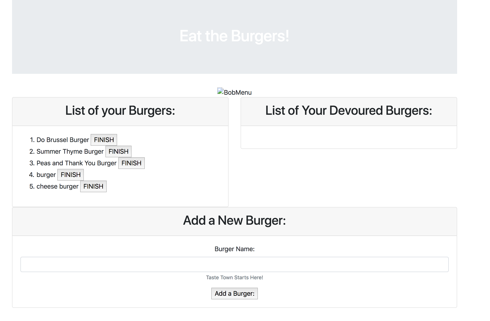
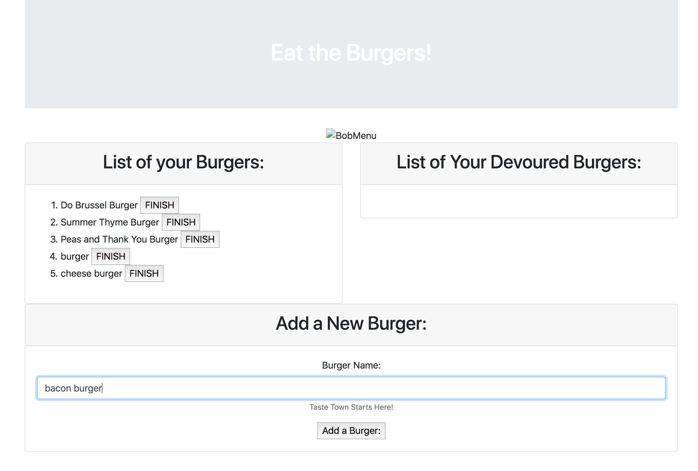
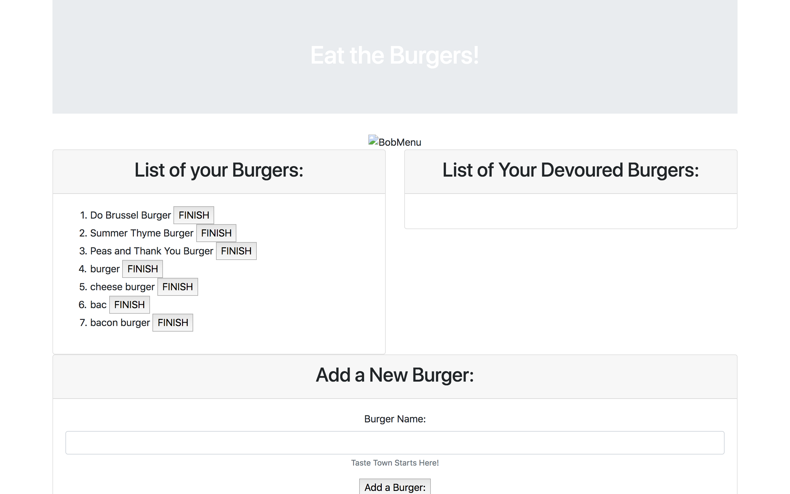

# burger

### OVERVIEW: 
Burger Boss is an app that allows users to input a burger, that is then generated to a list, then have the ability to eat that burger. 

### TECHNOLOGIES USED: 
- Node
- Express
- Handlebars
- MySQL 
- Deployed on Heroku 

## SCREENSHOTS:
### Home page: 

### Add burger: 

### Add burger listed: 

